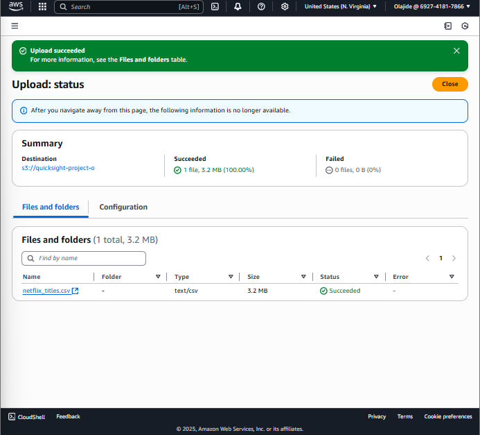
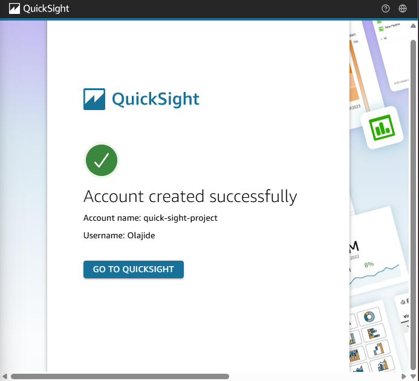
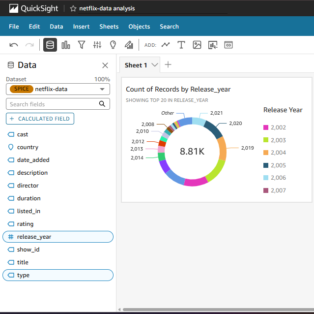
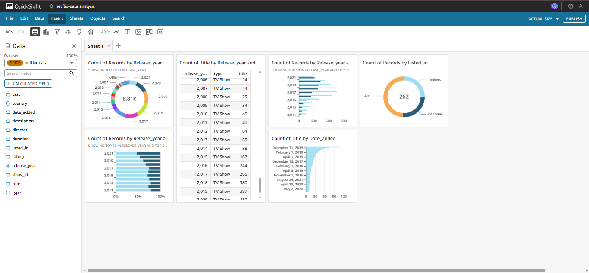

# 📊 Using Amazon QuickSight to Visualize Data

## 🧾 Overview

This project demonstrates how to use **Amazon QuickSight** to analyze and visualize data from a large dataset of Netflix shows and movies. The goal is to create an interactive dashboard that reveals key insights from the data.

---

## 📁 Step 1: Setting Up the Dataset in Amazon S3

- Created an **S3 bucket** to store the dataset (`netflix_titles.csv`) and the `manifest.json` file.
- Uploaded the dataset to the bucket.
- Edited the `manifest.json` to include the correct S3 object URL pointing to the dataset.
- Uploaded the modified `manifest.json` back into the S3 bucket.

---

## ⚙️ Step 2: Setting Up Amazon QuickSight

- Signed up for an **Amazon QuickSight** account (30-day free trial).
- Enabled **QuickSight access to S3** so it could process the dataset stored in my bucket.
- Connected QuickSight to my S3 bucket using the manifest file as a data source.

---

## 📈 Step 3: Building Visualizations

- Used the **AutoGraph feature** by dragging relevant fields into the visualization pane.
- Created a **donut chart** showing the count of records by release year.
- Built additional charts using field modifications and filters to extract meaningful insights from the dataset.

---

## 📊 Step 4: Finalizing the Dashboard

- Published the final dashboard for easy access and sharing.
- Exported the dashboard as a **PDF** for offline viewing.

---

## ✅ Key Takeaways

- QuickSight makes it easy to explore and visualize data directly from Amazon S3.
- You must grant QuickSight explicit access to the S3 bucket containing your dataset.
- Using a `manifest.json` file is necessary for S3-sourced datasets.

---

## 📂 Files Used

- `netflix_titles.csv`
- `manifest.json`

---
